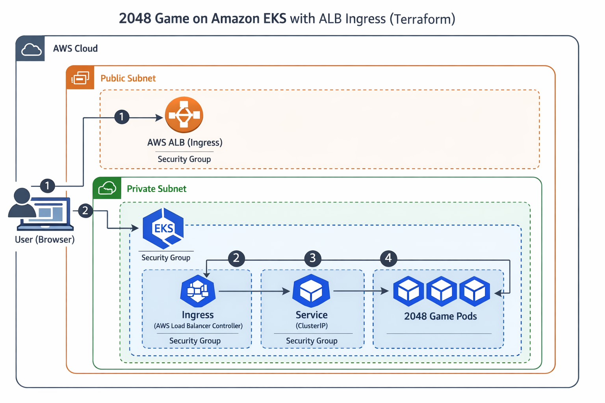

# 🎮 2048 Game on Amazon EKS (Terraform + ALB)

This project demonstrates a **production-ready deployment** of the classic **2048 game**
on **Amazon EKS**, using **Terraform** for infrastructure and **AWS Application Load Balancer (ALB)**
for external access.

The project follows **real industry practices**:
- Infrastructure as Code
- Kubernetes best practices
- Secure AWS integration (IRSA)
- Clean teardown (no leftover cost)

---

## 🐳 Docker Image Used

This project uses a public Docker image for the 2048 game:

- **Image:** [`cnrock/2048`](https://hub.docker.com/r/cnrock/2048)
- **Registry:** [`Docker Hub`](https://hub.docker.com/r/cnrock/2048)

Pull the image locally (optional):

```bash
docker pull cnrock/2048
```

---

## 🏗 Architecture Overview



### Architecture Flow
1. User (Browser)
2. AWS Application Load Balancer (ALB)
3. Kubernetes Ingress (AWS Load Balancer Controller)
4. Kubernetes Service (ClusterIP)
5. 2048 Application Pods (Deployment)

---

## 🚀 Technologies Used

| Layer | Tools |
|-----|------|
| Infrastructure as Code | Terraform |
| Managed Kubernetes | Amazon AKS |
| Container orchestration | Kubernetes |
| ALB integration | AWS Load Balancer Controller |
| Secure AWS access | IAM Roles |
| Containerized application | Docker |
| Version control | GitHub |

---

## 📁 Repository Structure

```bash
eks-2048-alb-terraform/
├── deployment.yaml                 # Kubernetes Deployment
├── service.yaml                    # ClusterIP Service
├── namespace.yaml                  # Production Namespace
├── alb-ingress.yaml                # ALB Ingress Definition
├── hpa.yaml                        # Horizontal Pod Autoscaler
├── iam_policy.json                 # IAM Policy
├── terraform/
│ ├── main.tf                       # VPC + EKS resources
│ ├── providers.tf                  # AWS provider
│ ├── variables.tf                  # Input variables
│ ├── outputs.tf                    # Terraform outputs
│ └── terraform.tfvars              # Environment values
├── .gitignore                      # Security best practices
└── README.md
```

---

## ⚙️ Prerequisites

- AWS CLI configured
- Terraform ≥ 1.5
- kubectl
- eksctl
- Helm
- AWS account with EKS permissions

---

## 🛠 Infrastructure Setup (Terraform)

```bash
cd terraform
```
```bash
terraform init
```
```bash
terraform plan
```
```bash
terraform apply
```

---

## Update kubeconfig (AWS CLI)

```bash
aws eks update-kubeconfig \
  --region ap-south-1 \
  --name game-2048-prod
```

---

## Verify Cluster 

```bash
kubectl get nodes
```

---

## 📦 Deploy Application

```bash
kubectl apply -f namespace.yaml
```
```bash
kubectl apply -f deployment.yaml
```
```bash
kubectl apply -f service.yaml
```
```bash
kubectl apply -f hpa.yaml
```

---

## 🌐 Expose via ALB

```bash
kubectl apply -f alb-ingress.yaml
```
```bash
kubectl get ingress -n game-2048-prod
```
Open in Browse
```bash
http://<ALB-DNS-NAME>
```

---

## 📈 Scaling & Health

- Multiple replicas via Deployment
- Auto-scaling via HPA
- Health checks via probes

---

## 🧹 Cleanup (Stop AWS Cost)

```bash
kubectl delete namespace game-2048-prod
```
```bash
cd terraform
```
```bash
terraform destroy
```

---

## 👤 Author

Nikhil Acholiya
DevOps / Cloud Engineer

---  

## ⭐ Notes

This project is resume-ready and interview-ready.
